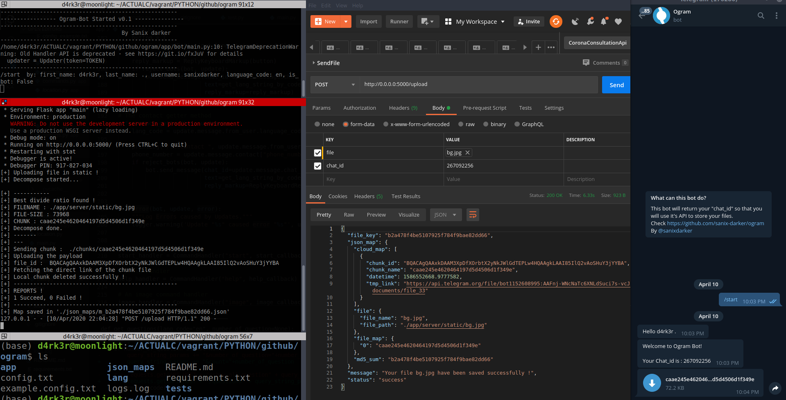

<center>
  

  # Ogram

  A Tricky-Hack to have your "INFINITE-STORAGE-API" using Telegram as a serving API !

  
</center>

## Links

Ogram split a file >= 19MB, in multiples chunks and send it throught the Telegram-bot. All the links of the running project :
- [THE BOT-LINK (omega_gram_bot)](https://t.me/omega_gram_bot) <br>
- [THE API-LINK (ogram_api)](https://ogram_api.ngrok.io)
- [THE DOCUMENTATION-API](https://documenter.getpostman.com/view/2696027/SzYgRaw1?version=latest)

## Requirements

- Python (3.x recommended)
- Pip3
- You need to have an account on Telegram

## How to install

- Go to https://t.me/omega_gram_bot(Or create your own bot with Botfather)
- Start the bot by hitting the START button or just write `/start` and then ENTER, you will get in response, your chat_id, you will use it with requests to ogram API to send files..
- Mute notification of the bot (Optionnal but recommended, to notreceive notifications for each chunk you're sending)
- Go to your Telegram Settings > Advanced > Automatic media download and deactive it, that will prevent telegram to automatically download a chunk of a file you're uploading !
.
- Update your `example.cofig.txt` file to `config.txt` and provide a valid token if you're using you're personnal bot.
- Install dependencies:
```shell
pip3 install -r requirements.txt
```

## How to launch

- You need to start the bot First, you can use this command :
```shell script
python -m app.bot.main
```

- You need to start the rest-api of Ogram on a new terminal too :
```shell script
python -m app.server.main
```

## Tests

- When you send a file using the API, you will get this king of response : 
```shell script
{
  "file_key": "b2a478f4be5107925f784f9bae82dd66",
  "json_map": {
    "cloud_map": [
      {
        "chunk_id": "BQACAgQAAxkDAAMlXpCQBGKASJqwi934DgKAJaxcy1sAAr8KAAI85IlQvfC_toG-uZcYBA",
        "chunk_name": "caae245e4620464197d5d4506d1f349e",
        "datetime": 1586532357.3464897,
        "tmp_link": "https://api.telegram.org/file/bot1152608995:AAFnj-WNcNaTc6XNLdSuci7s-vcJaJfeAi0/documents/file_26"
      }
    ],
    "file": {
      "file_name": "bg.jpg",
      "file_path": "./static/bg.jpg"
    },
    "file_map": {
      "0": "caae245e4620464197d5d4506d1f349e"
    },
    "md5_sum": "b2a478f4be5107925f784f9bae82dd66"
  },
  "message": "Your file bg.jpg have been saved successfully !",
  "status": "success"
}
```
**NB: The Limit size have been fixed to 100MB as a limit for the APi, but it can be changed !**

## Author

- Sanix-darker
